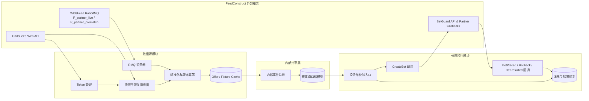
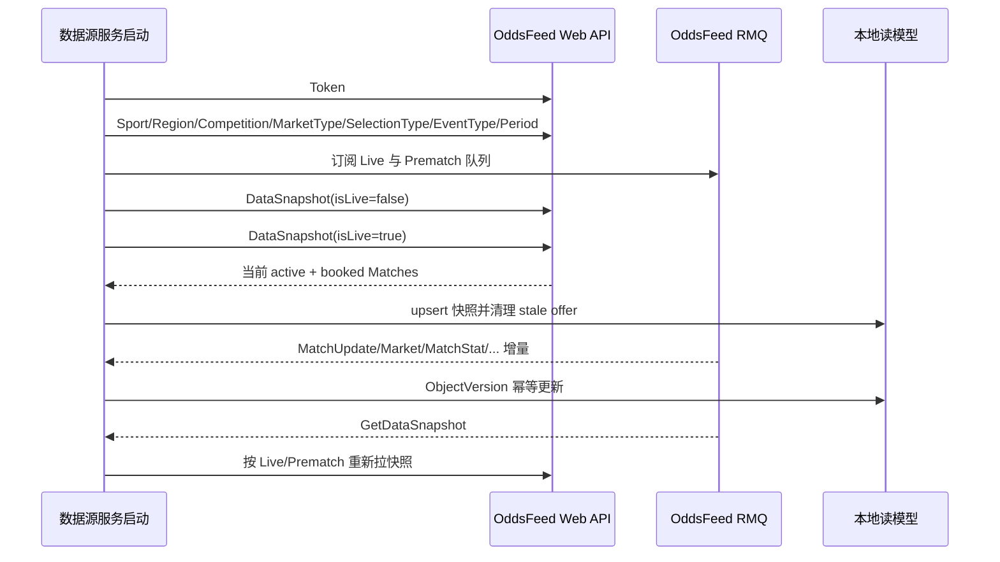

# BC 数据源模块与分控投注模块拆分设计

本文档用于将 **BC 数据源模块（FeedConstruct OddsFeed）** 与 **分控投注模块（FeedConstruct BetGuard）** 在系统职责、数据边界、恢复机制、赛前转滚球、基础信息获取、比分赔率更新以及结算处理上做清晰拆分。设计结论是：数据源模块应专注于 **赛事、盘口、赔率、比分、可见性、预订状态与结果类 feed 的接入和标准化**；分控投注模块应专注于 **投注创建、风控校验、最终确认、回滚、钱包入账与注单结算幂等**。两者之间只通过内部标准化的赛事与盘口状态、SelectionId/MarketTypeId/MatchId 等标识以及只读缓存协作，不应共享外部连接生命周期或把下注事务混入数据源消费链路。

> FeedConstruct OddsFeed 文档将 Web API 与 RabbitMQ 的职责区分为：Web API “specially designed for getting PreMatch and Live data snapshot and for static entities”，RabbitMQ “used for delivering asynchronous updates”。这一点是本拆分方案的核心依据。[1]

## 1. 总体拆分原则

BC 体系下应拆成两个一等模块：**OddsFeed Data Source Service** 与 **BetGuard Betting/Risk Service**。前者接入 RMQ 与 Web API，提供内部可订阅的标准数据流；后者接入 BetGuard API 与 Partner 回调，围绕注单状态机、余额交易和风控结果进行事务处理。官方 Odds Feed 产品页说明其能力覆盖 Live/In-play、Pre-match、赔率市场、实时 market resulting 与 translations；这些能力属于数据服务输入侧，而不是投注交易侧。[2]

| 模块 | 外部系统 | 核心输入 | 核心输出 | 不应承担的职责 |
|---|---|---|---|---|
| **数据源模块：OddsFeed Data Source Service** | FeedConstruct OddsFeed Web API、FeedConstruct OddsFeed RabbitMQ | Token、静态基础数据、Live/PreMatch DataSnapshot、`P[PartnerId]_live` 与 `P[PartnerId]_prematch` 队列消息 | 标准化赛事、联赛、地区、盘口、选项、赔率、比分、可见性、Booking 状态、Void/结果事件 | 不创建注单，不执行钱包扣款，不判定玩家限额，不处理 BetPlaced/BetResulted 回调 |
| **分控投注模块：BetGuard Betting/Risk Service** | FeedConstruct BetGuard API、Partner 回调接口 | 用户下注请求、数据源提供的 Selection/Market/Match 快照、BetGuard CreateBet/BetPlaced/Rollback/BetResulted | 注单创建结果、风控拒单原因、钱包交易、结算差额、注单终态 | 不消费 OddsFeed RMQ，不维护外部 feed 快照，不把比分赔率更新作为下注事务的一部分 |
| **共享内部层：Offer Cache / Internal Event Bus** | 内部数据库、缓存、消息总线 | 数据源标准事件与投注侧只读查询 | 对前端、下注校验、运营后台的统一查询模型 | 不直接连接外部 FeedConstruct 服务 |

该架构的关键约束是，**所有外部 feed 更新都先进入数据源模块的幂等层**，再进入内部读模型；**所有资金与注单状态变化都进入分控投注模块的账本层**。BetGuard 下单流程中，FC 在 CreateBet 后会检查赔率有效性、赛事和盘口可用性、可见性、限额和 Live delay，通过后才发起 BetPlaced 最终确认；这说明风控和交易状态机天然属于投注模块。[3]

## 2. 数据源关键点一：冷启动、断线重连与快照/Recovery

BC OddsFeed 的冷启动不是简单连接队列，而是一个 **“静态数据同步 → 队列订阅 → Live/PreMatch 快照 → 增量消息接管”** 的过程。首次接入需要通过 Web API 同步 Sports、Regions、Competitions、MarketTypes、SelectionTypes、EventTypes 与 Periods；文档同时建议这些基础数据每日同步一次，以降低遗漏更新的风险。[4]

| 阶段 | 数据源模块动作 | 数据依据 | 实现要点 |
|---:|---|---|---|
| 1 | 获取 Web API Token | `/api/DataService/Token`，Token 不应超过 24 小时重复请求 | Token 由数据源模块独占管理，刷新失败时阻断快照任务，不影响已入库读模型查询。[5] |
| 2 | 同步静态基础数据 | Sport、Region、Competition、MarketType、SelectionType、EventType、Period | 先全量 upsert，随后接收 RMQ 中的对应 Update 消息；每日低频补偿一次。[4] |
| 3 | 订阅 RMQ 队列 | `P[PartnerId]_live` 与 `P[PartnerId]_prematch` | Live 与 PreMatch 应独立消费、独立监控滞后、独立失败重试，但写入同一个标准化模型。[4] |
| 4 | 拉取快照 | `DataSnapshot?isLive=true/false` | 首次启动或故障超过 1 小时不带 `getChangesFrom`，故障少于 1 小时带 `getChangesFrom` 拉变化快照。[4] |
| 5 | 增量接管 | RMQ 的 Match/Market/MatchStat 等更新 | 每条消息落原始日志，标准化写入需基于 Match/Market 的 ObjectVersion 做乱序保护。[6] |
| 6 | 维护期或平台提示恢复 | 队列收到 `GetDataSnapshot` 命令 | 收到后必须主动拉取快照，用于补齐 FeedConstruct 平台发布或异常期间可能遗漏的数据。[7] |

> Integration Guide 对 DataSnapshot 的要求是：首次启动或中断超过 1 小时，应不带 `getChangesFrom` 拉全量；若中断小于 1 小时，则带 `getChangesFrom` 拉取指定分钟数之后的变化。[4]

快照恢复策略需要遵守两个重要限制。第一，DataSnapshot 只返回当前请求时刻 active 且账号已 booking 的 Live 或 Prematch 比赛；Completed、Cancelled 或不再可见的比赛不会出现在快照里，缺失事件需要用 MatchById 应急补拉。[4] 第二，DataSnapshot 文档明确给出调用频率限制：Live 与 Prematch 合计每 24 小时不应超过 10 次，因此数据源模块不能把快照当成轮询手段，而应依赖 RMQ 增量、原始消息日志和本地 offset/时间戳恢复。[5]

断线重连建议按中断时长分层处理。若 RMQ 消费器短暂重连且本地未丢失消息确认边界，应继续消费并用 ObjectVersion 防乱序；若检测到消费停滞、进程重启或连接不可用，应按最后成功处理的 `SocketTime` 或本地时间差计算 `getChangesFrom`，在小于 1 小时时拉变化快照；若超过 1 小时、无法确认断点、收到 `GetDataSnapshot`，或 FeedConstruct 维护后提示，则拉 Live 与 PreMatch 全量快照并做 offer 对账。[4] [6] [7]

## 3. 数据源关键点二：赛前盘如何在开赛前交接到滚球盘

BC OddsFeed 文档没有提供类似 Sportradar `handed_over` 的单一交接标记，因此赛前盘到滚球盘的交接应依据 **Match 生命周期字段、Live/PreMatch Booking 状态、双队列数据到达状态与计划开赛时间** 共同判断。Match Lifecycle 文档说明，Live 比赛从创建、available for Live、ready to start 到实际 start，关键字段组合会逐步变为 `LiveStatus=1`、`IsLive=true`、`IsStarted=true`，实际开赛时 `MatchStatus=1` 且 `LiveStatus=1`；结束或取消则分别表现为 `MatchStatus/LiveStatus=2` 或 `3`。[8]

| 场景 | 判定依据 | 数据源模块处理 | 前端/投注侧效果 |
|---|---|---|---|
| 赛前正常展示 | `IsLive=false` 或 MatchStatus 未开始，Prematch 已 booking，盘口 active | 写入 `offer_channel=prematch`，展示赛前盘口 | BetGuard 请求的 selection `IsLive=false` |
| 具备滚球可用性但未开始 | `LiveStatus=1`，可能已 Mark As Available/Ready to Start | 预热 live 读模型，保持 prematch 展示，持续监听 live 队列 | 可提前准备切换，但不立即展示滚球下注 |
| 实际开赛 | `MatchStatus=1` 且 `LiveStatus=1`，或 `IsLive=true` 且 `IsStarted=true` | 将同一 MatchId 的展示主通道切到 live，冻结或移除 prematch 盘口 | 新下注走 live selection，prematch betslip 二次校验通常拒绝或刷新 |
| 到计划开赛时间仍无 MatchStart | planned StartDate 已到且未收到 MatchStart | 按生命周期文档要求从 PreMatch offer 移除事件/MarketType | 避免赛前盘在开赛后“挂盘” |
| Live 未 booking 或被 unbook | Live booking 不存在，或收到 UnBookedObject | 从 Live offer 移除对应层级对象 | 不展示滚球，不允许以该通道下单 |

Match Lifecycle 文档明确要求，当 planned StartDate 到达而未收到 MatchStart 更新时，应从 PreMatch Offer 移除事件；Live Offer 也应在没有 Live Booking 或 Live Booking 改为 Unbooked 时移除。[8] 因此，交接实现不应等待某个单点消息，而应建立 **双通道状态机**：同一个 MatchId 同时维护 `prematch_state` 与 `live_state`，以 `channel` 区分盘口来源，以 `display_channel` 决定对前端展示哪个通道。

推荐的交接算法如下。首先，数据源模块长期同时订阅 live 与 prematch 两个队列，并定期通过 Calendar/Booking/MarketTypeBooking 确认某场比赛是否具备 PrematchBooked 与 LiveBooked 状态。[5] 当 live 通道开始收到该 MatchId 的 Match/Market/MatchStat 更新，且生命周期字段进入 started 或 ready-to-live 状态时，应把 `live_seen_at` 写入读模型。其次，一旦实际 start 成立，立即把 prematch 盘口标记为 `handover_closed`，不再允许新建赛前下注；若用户购物车仍持有 prematch selection，分控投注模块应在 CreateBet 前读取最新 offer 状态并提示刷新。最后，若计划开赛时间已到但未收到 live 更新，数据源模块也应清理 prematch offer，避免使用过期赛前盘。

## 4. 数据源关键点三：API 负责哪些数据，消息队列负责哪些数据

BC 的 Web API 和 RMQ 应按照 **“查询与恢复走 API，实时变更走消息队列”** 的原则使用。Web API 是幂等拉取、低频对账和应急补查接口；RMQ 是实时变化事实的主通道。把 API 用作轮询会碰到频率限制，也会放大冷启动和维护期风险。[1] [4] [5]

| 数据/动作 | Web API 负责 | RMQ 负责 | 设计建议 |
|---|---|---|---|
| 认证 | Token 获取与 24 小时内复用 | 不负责 | Token 管理由数据源模块集中封装，业务服务不直接持有外部凭据。[5] |
| 静态基础数据 | Sport、Region、Competition、MarketType、SelectionType、EventType、Period、SportOrder | 对应 Update 消息 | API 用于首启和每日补偿；RMQ 用于实时更新。[4] [7] |
| 赛程与预订 | Calendar、Booking、Book、MarketTypeBooking | BookedObject、UnBookedObject | Calendar 与 Booking 用于对账和运营；Book/Unbook 事件实时影响 offer 开关。[5] [7] |
| Live/PreMatch 快照 | DataSnapshot，按 `isLive` 区分，可选 `getChangesFrom` | `GetDataSnapshot` 只是触发信号 | 快照仅在首启、断线恢复、维护后或收到触发信号时调用。[4] [5] [7] |
| 指定实体补拉 | CompetitionById、MatchById、MarketTypeById、SelectionTypeById | 不负责补拉 | 仅用于缺失、历史、不可见、异常或客服排查场景，MatchById 有日调用限制。[5] |
| 比分与统计 | MatchById 可带 IncludeMatchStats 应急查询 | `MatchUpdate/Type=MatchStat` 或 `MatchStat` | 正常链路以 RMQ 为准，API 只做补偿。[7] [9] |
| 赔率与盘口 | DataSnapshot/MatchById 返回 Match 内 MarketsList | `MatchUpdate/Type=Market` | 正常链路以 RMQ 为准，并用 ObjectVersion 幂等。[6] [7] |
| 结果与 Void | Match/Selection 快照与 MatchById 可辅助追溯 | `VoidNotification`、Market/Selection outcome 更新 | 若接入 BetGuard，投注结算以 BetResulted 为资金准绳。[10] [11] |

## 5. 数据源关键点四：如何获取比赛、联赛、地区/国家信息

FeedConstruct 的实体层级可理解为 `Sport → Region → Competition → Match → Market → Selection`。其中 Region 是赛事所属地区/国家维度，Competition 是联赛或赛事集合，Match 是具体比赛，Market/Selection 是盘口与投注选项。Competition 对象包含 SportId 与 RegionId，Match 对象包含 CompetitionId、SportId、RegionId、MatchMembers、MarketsList 与 Stat 等字段，因此数据源模块应在内部建立完整的维表与事实表映射。[12] [13]

| 目标信息 | 首次/定时获取 | 实时更新 | 关键字段与说明 |
|---|---|---|---|
| 体育类型 | `/api/DataService/Sport` | `SportUpdate` | SportId 是上层维度，用于过滤 Calendar、Competition、MarketType 等。[5] [7] |
| 地区/国家 | `/api/DataService/Region` | `RegionUpdate` | RegionId 代表赛事所属地区或国家，后续由 Competition 与 Match 引用。[5] [7] |
| 联赛/赛事集合 | `/api/DataService/Competition?SportId=&RegionId=`；也可 `CompetitionById` | `CompetitionUpdate` | Competition 包含 `SportId`、`RegionId`、`IsTeamsReversed` 与 `LiveDelay` 等字段。[5] [12] |
| 比赛赛程 | `/api/DataService/Calendar?SportId=` | MatchUpdate/BookedObject/UnBookedObject | Calendar 最多返回 10 天数据，含 PrematchBooked、LiveBooked、MatchStatus、LiveStatus 等字段。[5] [14] |
| 指定比赛详情 | `/api/DataService/MatchById?MatchId=&IncludeMatchStats=true/false` | `MatchUpdate`、`MatchStat`、`Market` | 用于异常补拉、历史或不可见比赛查询；不应替代 RMQ 主链路。[5] |
| 盘口类型与选项类型 | `/api/DataService/MarketType`、`SelectionType` 及 ById 接口 | `MarketTypeUpdate`、`SelectionTypeUpdate` | 用于解释 MarketTypeId、SelectionTypeId、模板名称与展示顺序。[5] [15] [16] |

名称本地化不应在数据源主链路里临时查询。OddsFeed 对 Sport、Region、Competition、MarketType、SelectionType 等对象提供 NameId，Translations RMQ/Web API 可用于把 NameId 映射为多语言文本；若前端需要中文、英文或其他语言展示，应单独建立翻译维表，并通过 TranslationUpdate 增量更新。[17]

## 6. 数据源关键点五：比分变化、赔率变化与结算消息如何更新/接收

比分变化由 MatchStat 类消息驱动。RMQ 文档列出的实时消息形态包括 `MatchUpdate` 且 `Type=MatchStat`，也包括独立的 `MatchStat` 命令；Stat 对象包含 `Score`、`PeriodScore`、`CurrentMinute`、`CornerScore`、`YellowcardScore`、`RedcardScore`、`PenaltyScore`、`AdditionalMinutes` 等字段。[7] [9] 数据源模块应将比分更新拆成“总比分、分节/半场比分、事件分钟、附加统计”四类写入内部模型，以便不同运动项目按需展示。

赔率变化由 Market 类消息驱动。`MatchUpdate/Type=Market` 会携带 Market 对象，Market 内含 `Selections` 数组，每个 Selection 包含 `Price`、`OriginalPrice`、`IsSuspended`、`IsVisible`、`Outcome`、`SelectionTypeId`、`Handicap` 等字段；Market 自身也含 `IsSuspended`、`IsVisible`、`MarketTypeId`、`CashOutAvailable`、`HomeScore`、`AwayScore` 与 `ObjectVersion`。[7] [18] [19] 对于 fast-changing sports，文档要求 Match 和 Market 的 ObjectVersion 必须参与版本校验，收到低于本地版本的更新应跳过。[6]

| 更新类型 | 外部消息 | 数据源处理 | 投注侧影响 |
|---|---|---|---|
| 比分更新 | `MatchUpdate/Type=MatchStat` 或 `MatchStat` | 更新 scoreboard 与统计明细；若 EventType 为 Finished 或 Match 状态 completed，则触发比赛结束状态 | 前端比分刷新；下注时 MatchInfo 可使用最新 live 信息 |
| 赔率更新 | `MatchUpdate/Type=Market` | 基于 MarketId 与 ObjectVersion upsert；更新 Selection Price、OriginalPrice、可见/暂停状态 | 分控投注模块在下注前读取最新价格与 active 状态，避免旧价下注 |
| 盘口关闭/暂停 | Market/Selection 的 `IsSuspended=true` 或 `IsVisible=false` | 标记 market/selection inactive；active 条件是未暂停且可见 | 购物车中对应 selection 应刷新或阻断下单 |
| Booking 变化 | `BookedObject`、`UnBookedObject` | 按 Sport/Region/Competition/Match/MarketType 层级开启或关闭 offer | 若 unbook，投注模块不应继续发送对应 bet request |
| Void/Unvoid | `VoidNotification` | 记录对象级 void/unvoid 及影响范围，必要时发布内部结果调整事件 | 若已下注，资金层最终以 BetGuard BetResulted 或 Rollback 为准 |
| 注单结算 | BetGuard `BetResulted` 回调 | 不由数据源模块处理，只可作为结果事件旁路记录 | 投注模块按 Amount 差额入账并幂等去重 |

需要特别区分 **“盘口结果/选项结果”** 与 **“注单资金结算”**。OddsFeed Selection 对象存在 Outcome 字段，可表达 Not Resulted、Return、Lost、Won、WinReturn、LoseReturn 等结果，但文档明确提示：在 BetGuard 服务中该字段不可用。[19] 因此，当系统接入 BetGuard 时，投注资金结算不能依赖 OddsFeed Selection Outcome，而必须以 BetGuard 的 `BetResulted` 回调为准。BetResulted 会在 accepted bet 被 settled、updated 或 result canceled 时调用，且同一 bet 可能多次回调；Partner 应以新的 Amount 与此前已入账 Amount 的差额调整玩家余额，而不应单纯依赖 BetState。[11]

> BetGuard BetResulted 文档要求：如果同一 bet 收到多次 BetResulted 调用，应 “Adjust the Client’s balance by the difference between the new Amount and the previously credited amount”。这决定了投注模块必须拥有独立账本和幂等交易表。[11]

## 7. 分控投注模块边界：下注、确认、回滚与结算

投注模块接收前端下注请求时，应只把数据源读模型作为 **只读事实源**，用于校验 selection 是否仍 active、价格是否变化、比赛是否已转 live、Market/Match 是否可见。真正的风控、限额、Live Delay 和事件/盘口可用性校验由 BetGuard 在 CreateBet 流程中执行；若校验未通过，FeedConstruct 会直接拒绝 CreateBet，不会进入 BetPlaced 最终确认。[3]

| 流程节点 | 外部接口/回调 | 所属模块 | 幂等与超时要求 |
|---|---|---|---|
| 用户下注 | Partner → BetGuard `CreateBet` | 分控投注模块 | 请求前记录本地 bet attempt，读取数据源快照二次校验 price/active/channel |
| 风控校验 | FeedConstruct 内部校验 | BetGuard 外部系统 | 校验赔率相关性、market/event availability、visibility、limits、Live delay。[3] |
| 最终确认 | BetGuard → Partner `BetPlaced` | 分控投注模块 | Partner 5 秒内响应；超时或错误会触发 Rollback，BetPlaced 中 TransactionId 用于去重。[20] |
| 回滚补偿 | BetGuard → Partner `Rollback` | 分控投注模块 | 若未处理原 BetPlaced 也应安全返回成功，防止重复重试造成悬挂状态。[21] |
| 结算入账 | BetGuard → Partner `BetResulted` | 分控投注模块 | 同一 bet 可多次回调；以 Amount 差额入账，BetState 仅用于展示。[11] |
| 结算补发 | Partner → BetGuard `ResendFailedTransfers` | 分控投注模块/运维 | 用于补发失败 BetResulted，适合日常对账，不属于实时数据源链路。[22] |

这种边界可以避免一个常见风险：数据源模块刚收到赔率变化或暂停消息时，投注模块仍可能基于旧购物车发起 CreateBet。正确做法不是让数据源模块直接拒单，而是由投注模块在提交前读取最新读模型做“前置刷新”，随后仍以 BetGuard CreateBet 的结果为最终判定；这样既保证用户体验，也尊重 FC 风控侧对最终价格、限额和 Live Delay 的权威判断。[3]

## 8. 推荐内部事件模型

为了让前端、投注与运营后台不直接耦合 FeedConstruct 原始结构，数据源模块应将 RMQ/Web API 输出标准化为内部事件。事件至少应包含 `provider=feedconstruct`、`channel=prematch|live`、`source_command`、`socket_time`、`object_version`、`match_id`、`market_id`、`selection_id`、`active`、`visibility_reason` 与原始 payload 引用。

| 内部事件 | 触发来源 | 主要字段 | 消费方 |
|---|---|---|---|
| `sport.upserted` / `region.upserted` / `competition.upserted` | API 首启同步或 RMQ Update | id、name、name_id、sport_id、region_id | 前端目录、运营后台、翻译服务 |
| `match.upserted` | DataSnapshot、MatchUpdate/Type=Match、MatchById | match_id、competition_id、status、is_live、is_started、members、object_version | 前端赛程、投注校验 |
| `market.upserted` | DataSnapshot、MatchUpdate/Type=Market | market_id、match_id、market_type_id、handicap、cashout、object_version | 前端盘口、投注校验 |
| `selection.price_changed` | Market 内 Selection 变化 | selection_id、market_id、price、original_price、active、selection_type_id | 前端赔率刷新、购物车刷新 |
| `scoreboard.updated` | MatchStat | match_id、score、period_score、minute、period、cards/corners 等统计 | 前端比分、赛况组件 |
| `offer.closed` | UnBookedObject、IsVisible/IsSuspended、生命周期结束 | object_type、object_id、channel、reason | 前端关盘、投注前置阻断 |
| `snapshot.requested` | GetDataSnapshot 或运维触发 | channel、reason、requested_at | 快照协调器 |
| `bet.resulted` | BetGuard BetResulted | bet_id、transaction_id、amount、bet_state、is_void、is_resettled | 仅投注模块账本，不进入数据源主链路 |

## 9. 落地检查清单

上线前应重点验证六类场景。第一，冷启动必须在静态维表、队列订阅、Live/PreMatch 快照全部完成后再对前端宣告数据源 ready。第二，断线少于 1 小时与超过 1 小时要走不同快照策略，并监控 DataSnapshot 的 24 小时调用上限。第三，赛前到滚球交接必须同时覆盖实际开赛、计划开赛但未收到 start、Live 未 booking、UnBookedObject 四种状态。第四，Match 与 Market 的 ObjectVersion 必须做无符号数值比较，低版本更新必须跳过。第五，比分和赔率更新要分别进入 scoreboard 与 market read model，避免用 MatchStat 推导赔率或用 Market 推导比赛结束。第六，BetGuard BetResulted 必须按 TransactionId 幂等，并按 Amount 差额入账，不能让数据源 Selection Outcome 直接触发钱包结算。

| 风险 | 典型后果 | 预防措施 |
|---|---|---|
| 把 DataSnapshot 当轮询 | 触发调用限制，恢复能力下降 | 仅用于首启、断线、维护与 GetDataSnapshot 触发；常规更新依赖 RMQ |
| 赛前盘开赛后未关闭 | 用户以旧价格或旧通道下单 | planned StartDate 到达且无 MatchStart 时关闭 Prematch offer；实际 Live 开始时强制切通道 |
| 忽略 ObjectVersion | 快速运动项目盘口回滚到旧值 | 所有 Match/Market 更新做版本比较并记录 skipped_old_version 指标 |
| 投注模块直接信任购物车价格 | CreateBet 高拒单或用户体验差 | 下单前读取数据源读模型二次刷新，但最终仍以 BetGuard 为准 |
| 用 Outcome 做资金结算 | BetGuard 场景下结算缺失或错误 | 资金只认 BetResulted；Outcome/Void 仅做结果展示或辅助对账 |
| 回调非幂等 | 重复入账、悬挂 pending | BetPlaced/Rollback/BetResulted 均以 TransactionId/BetId 建幂等表 |

## References

[1]: ../01_data_feed/rmq-web-api/001_summary.md "FeedConstruct OddsFeed RMQ and Web API Summary"
[2]: https://www.feedconstruct.com/products/odds-feed "FeedConstruct Odds Feed Product Page"
[3]: ../06_betguard_risk/betguard/002_bet-placement-process.md "BetGuard Bet Placement Process"
[4]: ../01_data_feed/rmq-web-api/003_integrationguide.md "OddsFeed RMQ/Web API Integration Guide"
[5]: ../01_data_feed/rmq-web-api/033_webmethods.md "OddsFeed RMQ/Web API Web Methods"
[6]: ../01_data_feed/tcp-socket-api/030_integrationnotes.md "OddsFeed Integration Notes: ObjectVersion"
[7]: ../01_data_feed/rmq-web-api/034_objectsaspartfeed.md "OddsFeed Objects as Part of the Feed"
[8]: ../03_sports_model_reference/match-lifecycle/001_match-lifecycle.md "Match Lifecycle"
[9]: ../01_data_feed/rmq-web-api/011_stat.md "OddsFeed Stat Object"
[10]: ../01_data_feed/rmq-web-api/015_voidnotification.md "OddsFeed VoidNotification Object"
[11]: ../06_betguard_risk/betguard/045_bet-resulted.md "BetGuard BetResulted"
[12]: ../01_data_feed/rmq-web-api/007_competition.md "OddsFeed Competition Object"
[13]: ../01_data_feed/rmq-web-api/008_match.md "OddsFeed Match Object"
[14]: ../01_data_feed/rmq-web-api/017_calendar-match.md "OddsFeed Calendar Match Object"
[15]: ../01_data_feed/rmq-web-api/013_markettype.md "OddsFeed MarketType Object"
[16]: ../01_data_feed/rmq-web-api/014_selectiontype.md "OddsFeed SelectionType Object"
[17]: ../02_translations/translations-rmq-web-api/011_objectsaspartfeed.md "Translations Objects as Part of the Feed"
[18]: ../01_data_feed/rmq-web-api/009_market.md "OddsFeed Market Object"
[19]: ../01_data_feed/rmq-web-api/010_selection.md "OddsFeed Selection Object"
[20]: ../06_betguard_risk/betguard/042_partner-api-bet-placed.md "BetGuard Partner API BetPlaced"
[21]: ../06_betguard_risk/betguard/049_partner-api-rollback.md "BetGuard Partner API Rollback"
[22]: ../06_betguard_risk/betguard/024_resend-failed-transfers.md "BetGuard Resend Failed Transfers"
